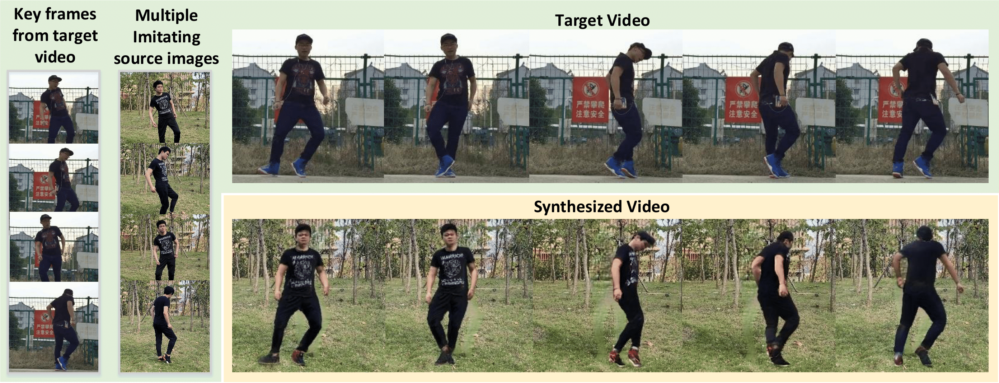
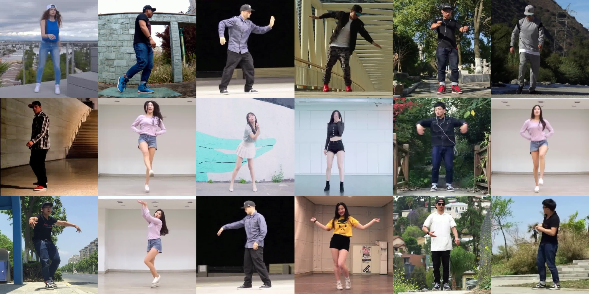

# JAFPro

<div style="text-align: center">
<br>
</div>

This repository contains official code for the paper
[JAFPro: Joint Appearance Fusion and Propagation for Human Video Motion Transfer from Multiple Reference Images](https://dl.acm.org/doi/10.1145/3394171.3414001).

You can find detailed usage instructions for training from scratch and testing pre-trained model below.


If you find our code or paper useful, please consider citing

    @inproceedings{10.1145/3394171.3414001,
    author = {Yu, Xianggang and Liu, Haolin and Han, Xiaoguang and Li, Zhen and Xiong, Zixiang and Cui, Shuguang},
    title = {JAFPro: Joint Appearance Fusion and Propagation for Human Video Motion Transfer from Multiple Reference Images},
    year = {2020},
    booktitle = {Proceedings of the 28th ACM International Conference on Multimedia},
    }


## Installation

First you have to make sure that you have all dependencies in place.
The simplest way to do so, is to use [anaconda](https://www.anaconda.com/). 

You can create an anaconda environment called `JAFPro` using
```
conda env create -f environment.yml
conda activate JAFPro
```


## DanceVideo Dataset

<div style="text-align: center">
<br>
</div>

Our DanceVideo dataset consists of 1651 dance videos in the wild with static background. Each video has a length of two seconds with 15FPS (30 frames in total). The resolution of all videos is 256x256. You can download the whole dataset through https://drive.google.com/file/d/1xlybcxZXcQUCgUuq1K2FLaVGSr8d_NJW/view?usp=sharing


## Usage

Once you have installed all dependencies and downloaded the dataset, you are ready to test our pre-trained model or train a model from scratch.

### File structure

Except code directories, the scripts assume the following file structure.

```
JAFPro
├── checkpoints                # opt['model_save_dir'], where checkpoints placed
└── test_results               # opt["test_save_dir"], path to save test results
```

### Testing pretrained model

At first, download the pretrained model from https://drive.google.com/file/d/1q4Lu6ayHG3-dAl5mE4b6tr6e-O3SHbye/view?usp=sharing, and unzip it into `checkpoints` directory.

```
JAFPro
├── checkpoints 
	├── $model_name             # e.g. appearance_propagation_interval
		├── Accu_iter_xx.pth
		├── bg_iter_xx.pth
		├── inpaint_iter_xx.pth
		├── pro_iter_xx.pth
		├── refine_iter_xx.pth
```


Then, you have to setup the data root in `options.py`

```
opt['smpl_root'] = '/your/path/to/DanceVideo/smpls'
opt['mask_root'] = '/your/path/to/DanceVideo/masks'
opt['data_root'] = '/your/path/to/DanceVideo/images'
```

To test the pretrained model, run 

```
cd test/
python conv_pro_test.py --gpu 0 -e appearance_propagation_interval -n 4
```
arguments explanation:
```
--gpu: specify gpu device
-e: experiment name (model_name). The program will load checkpoints from JAFPro/checkpoints/$model_name
-n: number of frames
```

And the results will be saved to `test_results/$model_name`

### Calculate metrics

After testing a pretrained model, you can calculate metrics by running

```
python video_evaluation.py --pred /path/to/test/results/dir  --gt /path/to/DanceVideo/images/test --gpu 0 --type densepose
```

such that the metric for each video and for whole test set will be printed to terminal.


### Train a model from scratch

First, setup data root path in `options.py`
```
opt['smpl_root'] = '/your/path/to/DanceVideo/smpls'
opt['mask_root'] = '/your/path/to/DanceVideo/masks'
opt['data_root'] = '/your/path/to/DanceVideo/images'
```
Then, train the texture accumulation model by running the text_accu_LSTM.py for 5000 iterations. <br>
Next, load the pretrained weight for texture accumulation, and run text_inpatin_convLSTM.py for 20000 iterations. <br>
Next, load the pretrained weight in the previous training, and run inpaint_global_convLSTM_FGAN.py for 20000 iterations. <br>
Finally, load the pretrained weight in the previous training, and run convLSTM_flowpro_Iinterval.py for 42000 iterations.


You can monitor on <http://localhost:6006> the training process using [tensorboard](https://www.tensorflow.org/guide/summaries_and_tensorboard):
```
cd OUTPUT_DIR
tensorboard --logdir ./monitoring --port 6006
```

